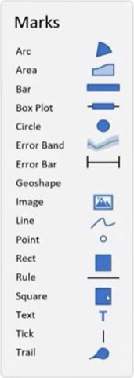

# Marks
Vega creates charts by encoding data on basic shapes called **Marks**. 

*Image from [Deneb for aesthetics With Kerry Kolosko – YouTube](https://youtu.be/zTcIn7YKgjo)*

What makes Vega charts so rich, is that you create a visual by layering these various Marks on top of each other. This sample chart is one simple visual, but is built with 7 separate marks. It gives the designer detailed control over every element in a visual.

*From [Workout Wednesday 2023 Week 3](https://github.com/somedaygone/deneb-help/blob/main/Wow/WoW%202023%20Week%203%20Vertical%20Area%20Chart.pbix)*

## Comparison to Power BI visuals
In general, think of Vega marks as selecting your chart type in Power BI.

**Power BI charts that match a Vega mark**
|Power BI chart type|Vega Mark|
|---|---|
|[Bar/Column charts](https://learn.microsoft.com/en-us/power-bi/visuals/power-bi-visualization-types-for-reports-and-q-and-a#bar-and-column-charts)|[`bar`](https://vega.github.io/vega-lite/docs/bar.html)|
|[Line chart](https://learn.microsoft.com/en-us/power-bi/visuals/power-bi-visualization-types-for-reports-and-q-and-a#line-charts)|[`line`](https://vega.github.io/vega-lite/docs/line.html)|
|[Area charts](https://learn.microsoft.com/en-us/power-bi/visuals/power-bi-visualization-types-for-reports-and-q-and-a#area-charts-basic-layered-and-stacked)|[`area`](https://vega.github.io/vega-lite/docs/area.html)|
|[Scatter chart](https://learn.microsoft.com/en-us/power-bi/visuals/power-bi-visualization-types-for-reports-and-q-and-a#scatter)|[`point`](https://vega.github.io/vega-lite/docs/point.html)|
|[Pie](https://learn.microsoft.com/en-us/power-bi/visuals/power-bi-visualization-types-for-reports-and-q-and-a#pie-charts) / [Donut](https://learn.microsoft.com/en-us/power-bi/visuals/power-bi-visualization-types-for-reports-and-q-and-a#doughnut-charts) / [Gauge charts](https://learn.microsoft.com/en-us/power-bi/visuals/power-bi-visualization-types-for-reports-and-q-and-a#gauge-charts)|[`arc`](https://vega.github.io/vega-lite/docs/arc.html)|
|[Map charts](https://learn.microsoft.com/en-us/power-bi/visuals/power-bi-visualization-types-for-reports-and-q-and-a#maps)|[`geoshape`](https://vega.github.io/vega-lite/docs/geoshape.html)|
|[Card/Multi-row card](https://learn.microsoft.com/en-us/power-bi/visuals/power-bi-visualization-types-for-reports-and-q-and-a#cards) |[`Text`](https://vega.github.io/vega-lite/docs/text.html)
|[Images](https://learn.microsoft.com/en-us/power-bi/visuals/power-bi-visualization-types-for-reports-and-q-and-a#standalone-images)|[`image`](https://vega.github.io/vega-lite/docs/image.html)|

**Charts in Power BI that are layered charts in Vega**
|Power BI chart type|Vega example|
|--|--|
|[Line and column combo charts](https://learn.microsoft.com/en-us/power-bi/visuals/power-bi-visualization-types-for-reports-and-q-and-a#combo-charts)|[Covid cases](https://github.com/aezarebski/vegacookbook/tree/master/examples/uk-confirmed-cases)|
|[Ribbon chart](https://learn.microsoft.com/en-us/power-bi/visuals/power-bi-visualization-types-for-reports-and-q-and-a#ribbon-chart)|[Line Charts Showing Ranks Over Time](https://vega.github.io/vega-lite/examples/window_rank.html)|
|[Waterfall chart](https://learn.microsoft.com/en-us/power-bi/visuals/power-bi-visualization-types-for-reports-and-q-and-a#waterfall-charts)|[Waterfall chart](https://vega.github.io/vega-lite/examples/waterfall_chart.html)|
|[Funnel chart](https://learn.microsoft.com/en-us/power-bi/visuals/power-bi-visualization-types-for-reports-and-q-and-a#funnel-charts)|[Funnel chart](https://vega.github.io/editor/#/url/vega-lite/N4IgJAzgxgFgpgWwIYgFwhgF0wBwqgegIDc4BzJAOjIEtMYBXAI0poHsDp5kTykBaADZ04JAKyUAVhDYA7EABoQAEzjQATjRyZ289AGUkgtQAIAYg1my4gk7CTrMlEwBV4JzGxwmks5SaY2bDYEEwBSAIcIH3U4ExgkKABrOH9ffwT1fyg2VWVKRRUkTBRUUGIjBjU0AG1QQ2No-RKyODQQABk4JGVCgHkcHDZHSzoATwBhNktMNAAmADYADgBfBXqjU2akVvaARQYjGgAzMf7B4cxRzEnp2VnUAE4AFjWNxpNt3YM2QQYdOTnIYjWTjKYzNAAdle6xADS2LTa6AACuovGwIEYgZdrrcIagAMyQt5wzZNRHtMw0WRHABebSUA2BV1BN3B9zQAEZXgBdNYgTDqXwQY7DBC1UBQIxQBiCYpIopXBCUJk41l4+4EOaFJAQdrIv56klSwQyuWYBX8ZTFBjK1UgsF3TBanV69AAWWpDCNsJNZvl7WQAA8ABTWpUqi4OtlOgCUrsDSCD7NmxulsoD6AQ1LDNrtUZZjpm8aUusD1JTIBWPKUOkwxjQoAtQYeIHthZ01SUovu+ho9K5z1Lslgw3LymUDaUyiDaAJAAZp2dUJz5-ziDkR8UJSAAO40ZT0OdiRcYOA0MhYLliJRysZwdQ71QaLQAvQgFxeSKP2t0BtlAU4BbdpV3nMJCh7TA+wHFc5m7ORMAAdXPS9W2EVCH0KHJBDHdAAGIlkInURxgXCQGzCcpxUZc5jXJRkHUJJGwFMYcAVYRrCw34yPQrAyCFM5+TgEdcmpMhmNnADw1tLlTyTGg3VkWVBH5INtSkvM52eNcVhJZ8oE0bRdHaLpjkwb9CgYpiAJuNj2g4hkQGwniLz4gSqyUYScmUMSJOY6TxRXOSgwUtAlMEFSlGXUAArQYLQtQcLIpAMZ1JizSgt0vS1AM19jPQAAlVzzKYBxLIcaym1Y9jqUc5zH3QXjMH4pBBM8kSfNkcSAMk9KlS0+LFOU-losVGTUEGsLhqitKxsC1csr5WF9MMt9KUsaxbHsRxCn3Q8YGPU94GK69TzvTDUDqFQctW-KQAsKwbG-PV6Iq9pSp-EAvNErrmNG44aBsXoDDJT4KVrar2lkEJqSxJQZB2gCAaB9p21xSslC8doIBkzGsgu67oGEzrxN0pRepAZHBGBkADW9QpbIVABHQ57joYoaFIBm-yRJLSxCt1QDlJgbDdY4jAgOAyZANTmKpmnPSUl6WLs9AWd8OsOa5-lhlUBrQHl1GC3Rp0GchtXWc1nRtbJmKbrywF0AezaTDwkxhdF8rGOYxn2mbWYlHq9pdxgEQPK+jrfJsoCHgNwHqaN5kTYhCHVZAdW2ZKa22hGuX45p+FyR2RzffQaHsxpQRCgR2PKfzxO1SLDlMZwbHcZAXWCf04nfKy6sST2o9CRPJRjtQ69b1ai6rpWh33wAISCTxQg+7n6yRJsY-aCQ5nA+De37JFOTgymEOQk7GuKzDA+4hqQAIojh1HO+KMnRzlGXBY6PIt6bPNkAHJcRwnfJqLU2oR28lHUAFNYorgWDeEA8khoRXhiaDeKgQhIGpO6JMh1payw0v1FcSwxBZWWvbIyjtOhwDMhZV63s-5p0ATfYB9lipgPDt9EmflCHjU5PA-mCUkq514YFSaiVpopVmrAhattCa5Uoe+IqqE6E-wYVVJhtUgEuVQhwoSkdfo9X8hlTkJDBHIOSqNWB4jhEzWMUQ2R-c+RAA)
|[Treemap](https://learn.microsoft.com/en-us/power-bi/visuals/power-bi-visualization-types-for-reports-and-q-and-a#treemaps)|[Mosaic chart](https://vega.github.io/vega-lite/examples/rect_mosaic_labelled_with_offset.html)
|[KPIs](https://learn.microsoft.com/en-us/power-bi/visuals/power-bi-visualization-types-for-reports-and-q-and-a#kpis)|[KPIs in the Deneb sample file](https://appsource.powerbi.com/deneb.deneb7E15AEF80B9E4D4F8E12924291ECE89A.1.4.0.0.pbix)|

**Charts in Power BI that don't match well with Vega**

Certain Power BI visuals either are not really available in Vega, or just make more sense to keep in Power BI, for example, Slicers.
- [Slicers](https://learn.microsoft.com/en-us/power-bi/visuals/power-bi-visualization-types-for-reports-and-q-and-a#slicers)
- [Table](https://learn.microsoft.com/en-us/power-bi/visuals/power-bi-visualization-types-for-reports-and-q-and-a#tables) / [Matrix](https://learn.microsoft.com/en-us/power-bi/visuals/power-bi-visualization-types-for-reports-and-q-and-a#matrix)
- [Decomposition tree](https://learn.microsoft.com/en-us/power-bi/visuals/power-bi-visualization-types-for-reports-and-q-and-a#decomposition-tree)
- [Key influencers chart](https://learn.microsoft.com/en-us/power-bi/visuals/power-bi-visualization-types-for-reports-and-q-and-a#key-influencers-chart) - could be a custom combo chart in Vega though
- [ArcGIS](https://learn.microsoft.com/en-us/power-bi/visuals/power-bi-visualization-types-for-reports-and-q-and-a#arcgis-map) and [Azure maps](https://learn.microsoft.com/en-us/power-bi/visuals/power-bi-visualization-types-for-reports-and-q-and-a#azure-map) can benefit from data enrichment of these cloud services over [`geoshape`](https://vega.github.io/vega-lite/docs/geoshape.html) maps in Vega
- [Power Apps](https://learn.microsoft.com/en-us/power-bi/visuals/power-bi-visualization-types-for-reports-and-q-and-a#power-apps-visual)
- [Q&A](https://learn.microsoft.com/en-us/power-bi/visuals/power-bi-visualization-types-for-reports-and-q-and-a#qa-visual) (on second thought, you probably shouldn't use this at all!)
- [R](https://learn.microsoft.com/en-us/power-bi/visuals/power-bi-visualization-types-for-reports-and-q-and-a#r-script-visuals) and Python - only use if you need a library for a special function or to sync with a visual used elsewhere
- [Smart Narrative](https://learn.microsoft.com/en-us/power-bi/visuals/power-bi-visualization-types-for-reports-and-q-and-a#smart-narrative) - Can do this with [`Text`](https://vega.github.io/vega-lite/docs/text.html) in Vega, but I prefer the [**HTML Content** visual](https://appsource.microsoft.com/en-US/product/power-bi-visuals/WA200001930?exp=ubp8&tab=Overview) (also by Daniel Marsh-Patrick, creator of Deneb)
- **Metrics** is still in preview, but tied to a larger web service. The charts would be easy to do in Vega, but the data is tied to the Metrics app.
- Paginated Reports
- Power Automate

Also many of your favorite [AppSource](https://appsource.microsoft.com/en-US/marketplace/apps?exp=ubp8&product=power-platform%3Bpower-bi-visuals&page=1) custom visuals may still make sense for custom visuals like gantt charts or world clouds, or charts you may have already built in other code/scripting visuals like [D3.js](https://appsource.microsoft.com/en-US/product/power-bi-visuals/WA104381354?exp=ubp8&tab=Overview), [plotly.js](https://appsource.microsoft.com/en-US/product/power-bi-visuals/akvelon.plotlyjsvisualbyakvelon?exp=ubp8&tab=Overview), [HTML content](https://appsource.microsoft.com/en-US/product/power-bi-visuals/WA200001930?exp=ubp8&tab=Overview), and [Charticulator](https://appsource.microsoft.com/en-US/product/power-bi-visuals/WA200002793?exp=ubp8&tab=Overview).

---
[**Home**](../README.md)

**Next:** [Encodings](./encodings.md)

**Prev:** [Vega-lite examples](./vega-lite-examples.md)
