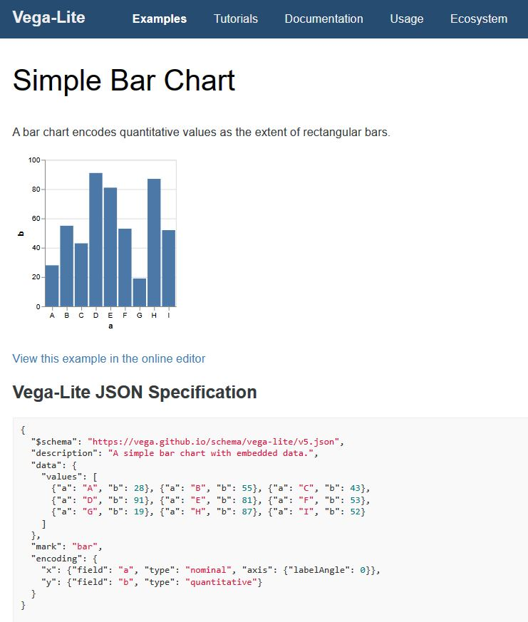
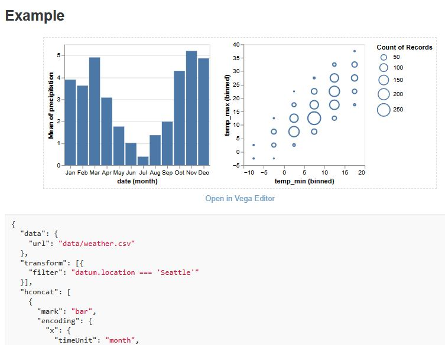
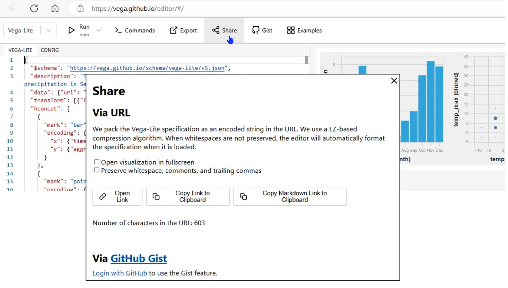

# Vega-lite examples
The official Vega-lite website has hundreds of working examples with code at: https://vega.github.io/vega-lite/examples/

You can interact with the chart on the page, click the link to try it in the online editor, or view/copy the JSON spec.

Also every example in the [Vega-lite Documentation](https://vega.github.io/vega-lite/docs/) is interactive as well, with the spec available and a link to the online editor.

The Vega examples are super easy to implement in Deneb. Most will work as-is, though occassionally I'll have to tweak it if the spec is using an older version of Vega. Most often it has been a matter of changing a value from `false` to `null`. For a walkthrough of the process, see my [Deneb Custom Visual in Power BI](https://github.com/somedaygone/deneb-help/blob/main/Wow/Deneb%20Custom%20Visual%20in%20Power%20BI.pptx) PowerPoint presentation.

You can also find tons of examples on StackOverflow under the [`[vega-lite]`](https://stackoverflow.com/questions/tagged/vega-lite) and [`[deneb]`](https://stackoverflow.com/questions/tagged/deneb) tags.

The [Vega online editor](https://vega.github.io/editor/#/) has a **Share** button that makes it easy to share a spec. It is best practice to share a link to the spec you are working on when asking for help on [StackOverflow](https://stackoverflow.com/questions/tagged/vega-lite). For StackOverflow, use the **Copy Markdown Link to Clipboard** button.

If you are looking for great Deneb examples, check out:
- [Kerry Kolosko's blog](https://kerrykolosko.com/category/custom-visualisations/deneb/) and [templates](https://kerrykolosko.com/portfolio-category/deneb-templates/)
- [David Bacci's GitHub](https://github.com/PBI-David/Deneb-Showcase)
- [The Deneb sample file](https://appsource.powerbi.com/deneb.deneb7E15AEF80B9E4D4F8E12924291ECE89A.1.4.0.0.pbix)
- [PowerBI.tips' collection of Deneb-Templates](https://github.com/PowerBI-tips/Deneb-Templates/tree/main/templates)
- - See also [How to import and export deneb templates](https://www.youtube.com/watch?v=fPVQRHyWZrc)
- [My collection of Deneb examples](https://github.com/somedaygone/deneb-help/blob/main/Wow/Deneb%20interactive%20charts.pbix), which includes ones from the Vega site, and some of my favorites from Kerry and David

Other Vega examples:
- [Vega Cook Book](https://github.com/aezarebski/vegacookbook) replicates BBC infographics
---
[**Home**](../README.md)

**Next:** [Marks](./marks.md)

**Prev:** [Vega-lite documentation](./vega-lite-doc.md)
