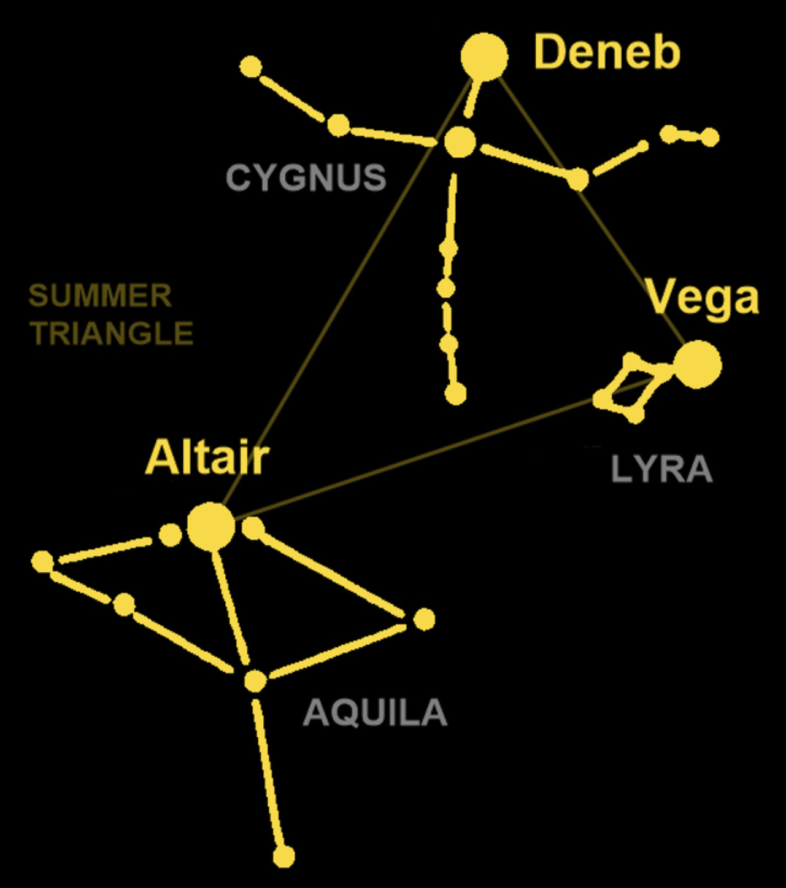

# Why is it called Deneb?
The [Vega language](https://vega.github.io/vega/) is named after the star [Vega](https://en.wikipedia.org/wiki/Vega), which happens to be the brightest star in the constellation [Lyra](https://en.wikipedia.org/wiki/Lyra). Other tools that are used with the Vega language also have space-themed names, such as:

- [Polestar](https://vega.github.io/polestar/)
- [Voyager 2](https://vega.github.io/voyager2/)
- [Lyra](http://idl.cs.washington.edu/projects/lyra/app/)
- [Altair](https://altair-viz.github.io/)
- [Deneb](https://deneb-viz.github.io/)

[Deneb](https://en.wikipedia.org/wiki/Deneb) is the brightest star in the constellation [Cygnus](https://en.wikipedia.org/wiki/Cygnus_(constellation)).

*ALTAIR: What happened to my lyre!!!*

*DENEB:  I dunno... I didn't do it.*

---
[**Home**](../README.md)

**Next:** [Why use Deneb?](./why-use-deneb.md)

**Prev:** [What is Vega?](./what-is-vega.md)